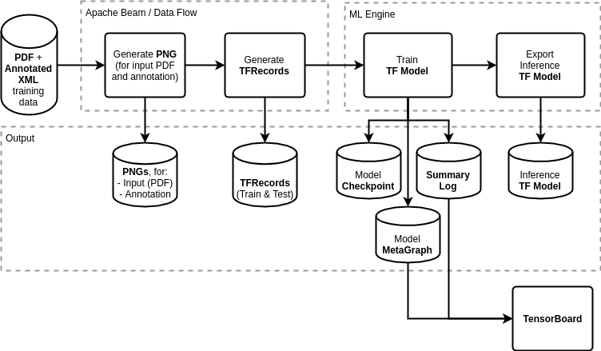
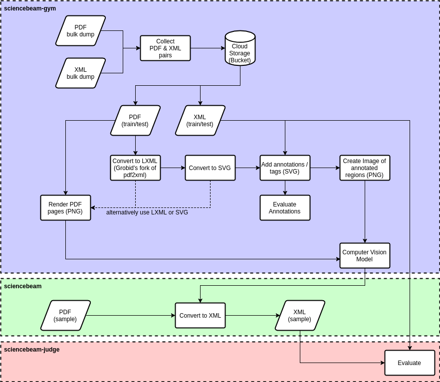

# ScienceBeam Gym

[](https://travis-ci.org/elifesciences/sciencebeam-gym)
[](LICENSE)

This is where the [ScienceBeam](https://github.com/elifesciences/sciencebeam) model is trained.

You can read more about the computer vision model in the [Wiki](https://github.com/elifesciences/sciencebeam-gym/wiki/Computer-Vision-Model).

## Pre-requisites

- Python 2.7 ([currently Apache Beam doesn't support Python 3](https://issues.apache.org/jira/browse/BEAM-1373))
- [Apache Beam](https://beam.apache.org/)
- [TensorFlow](https://www.tensorflow.org/) with google cloud support
- [gsutil](https://cloud.google.com/storage/docs/gsutil)

You can run the following to install Apache Beam and Tensorflow, but it may not be optimised for your platform:

```bash
pip install -r requirements.prereq.txt
```

## Dependencies

Dependencies not already mentioned in the prerequisites can be installed by running:

```bash
pip install -r requirements.txt
```

and:

```bash
pip install -r requirements.dev.txt
```

## Cython

Run:

```bash
python setup.py build_ext --inplace
```

## Local vs. Cloud

Almost all of the commands can be run locally or in the cloud. Simply add `--cloud` to the command to run it in the cloud. You will have to have [gsutil](https://cloud.google.com/storage/docs/gsutil) installed even when running locally.

Before running anything in the cloud, please run `upload-config.sh` to copy the required configuration to the cloud.

## Configuration

The default configuration is in the [prepare-shell.sh](prepare-shell.sh) script. Some of the configuration can be overriden by adding a `.config` file which overrides some of the variables, e.g.:

```bash
#!/bin/bash

TRAINING_SUFFIX=-gan-1-l1-100
TRAINING_ARGS="--gan_weight=1 --l1_weight=100"
USE_SEPARATE_CHANNELS=true
```

### Inspecting Configuration

By running `source prepare-shell.sh` the configuration can be inspected.

e.g. the following sequence of commands will print the data directory:

```bash
source prepare-shell.sh
echo $DATA_PATH
```

The following sections may refer to variables defined by that script.

## Computer Vision Model

### Pipeline

The TensorFlow training pipeline is illustrated in the following diagram:



The steps from the diagram are detailed below.

#### Preprocessing

The individual steps performed as part of the preprocessing are illustrated in the following diagram:



##### Find File Pairs

The preferred input layout is a directory containing a gzipped pdf (`.pdf.gz`) and gzipped xml (`.nxml.gz`), e.g.:

- manuscript_1/
  - manuscript_1.pdf.gz
  - manuscript_1.nxml.gz
- manuscript_2/
  - manuscript_2.pdf.gz
  - manuscript_2.nxml.gz

Using compressed files is optional but recommended to reduce file storage cost.

The parent directory per manuscript is optional. If that is not the case then the name before the extension must be identical (which is recommended in general).

Run:

```bash
python -m sciencebeam_utils.tools.find_file_pairs \
--data-path <source directory> \
--source-pattern *.pdf.gz --xml-pattern *.nxml.gz \
--out <output file list csv/tsv>
```

e.g.:

```bash
python -m sciencebeam_utils.tools.find_file_pairs \
--data-path gs://some-bucket/some-dataset \
--source-pattern *.pdf.gz --xml-pattern *.nxml.gz \
--out gs://some-bucket/some-dataset/file-list.tsv
```

That will create the TSV (tab separated) file `file-list.tsv` with the following columns:

- _source_url_
- _xml_url_

That file could also be generated using any other preferred method.

##### Split File List

To separate the file list into a _training_, _validation_ and _test_ dataset, the following script can be used:

```bash
python -m sciencebeam_utils.tools.split_csv_dataset \
--input <csv/tsv file list> \
--train 0.5 --validation 0.2 --test 0.3 --random --fill
```

e.g.:

```bash
python -m sciencebeam_utils.tools.split_csv_dataset \
--input gs://some-bucket/some-dataset/file-list.tsv \
--train 0.5 --validation 0.2 --test 0.3 --random --fill
```

That will create three separate files in the same directory:

- `file-list-train.tsv`
- `file-list-validation.tsv`
- `file-list-test.tsv`

The file pairs will be randomly selected (_--random_) and one group will also include all remaining file pairs that wouldn't get include due to rounding (_--fill_).

As with the previous step, you may decide to use your own process instead.

Note: those files shouldn't change anymore once you used those files

##### Preprocess

The output of this step are the [TFRecord](https://www.tensorflow.org/programmers_guide/datasets) files used by the training process. TFRecord files are a bit like binary csv files.

The input files are pairs of PDF and XML files (using file lists generated in the previous steps).

Run:

```bash
./preprocess.sh [--cloud]
```

That will run the preprocessing pipeline for:

- training dataset using `file-list-train.tsv`
- validation dataset using `file-list-validation.tsv`
- qualitative dataset using first _n_ files and first page of `file-list-validation.tsv` (optional)

Part of the preprocessing is an auto-annotation step which aligns text from the XML with the text in the PDF to tag the corresponding regions appropriately. It is using the [Smith Waterman algorithm](https://en.wikipedia.org/wiki/Smith_waterman). It may take some time (roughly 6 seconds per page). It will also make mistakes but for the samples we used it was good enough.

You can inspect some details (e.g. count) of the resulting TFRecords by running the following command:

```bash
./inspect-tf-records.sh [--cloud]
```

### Train TF Model

Running the following command will train the model:

```bash
./train.sh [--cloud]
```

### Export Inference Model

To export a [saved model](https://www.tensorflow.org/programmers_guide/saved_model):

```bash
./save-model [--cloud]
```

The saved model will have one predict signature:

- batch RGB input image (variable batch size)
- batch RGB output image (showing the nearest annotation)

The input image will be resized to the model image size, currently 256x256.

### Predict

Prediction using the latest checkpoint:

```bash
./predict.sh <input png file> [<output png file>] [--cloud]
```

Prediction using the saved model:

```bash
./predict-using-saved-model.sh <input png file> [<output png file>] [--cloud]
```

As per the saved model, the input image will be resized and the output image will have the same size.

### Annotate LXML using prediction images

Note: The annotation using a prediction image is simplistic. A higher model is recommended.

```bash
python -m sciencebeam_gym.inference_model.annotate_using_predictions \
  --lxml-path=<lxml file> \
  --images-path <annotated image page 1> [<annotated image page 2..n>] \
  --output-path=<output annotated lxml file>
```

e.g.:

```bash
python -m sciencebeam_gym.inference_model.annotate_using_predictions \
  --lxml-path=sample.lxml \
  --images-path page-01.png.out.png page-02.png.out.png page-03.png.out.png \
  --output-path=sample.annot.lxml
```

### TensorBoard

Run the TensorBoard with the correct path:

```bash
./tensorboard.sh [--cloud]
```

## CRF Model

A (Linear Chain) [CRF](https://en.wikipedia.org/wiki/Conditional_random_field) model is also trained to ingest the training data.

### Annotated SVG File List

When running the (CV) preprocessing pipeline with the parameter `--save-svg`, files with the file ext `.svg.zip` will be written to the _output path_. To get a list of those one can use the following command:

```bash
python -m sciencebeam_utils.tools.get_output_files \
  --source-file-list path/to/file-list-train.tsv --source-file-column=pdf-url \
  --output-file-suffix=.svg.zip --output-file-list path/to/file-list-train-svg.tsv
```

### Annotated LXML Files using CV (Optional)

The CRF Model can also be trained using the CV output as an additional input.

When running the CV conversion pipeline with the parameter `--save-annot-lxml`, files with the ext `.cv.lxml.gz` will be written to the _output path_. To get a list of those one can use the following command:

```bash
python -m sciencebeam_utils.tools.get_output_files \
  --source-file-list path/to/file-list-train.tsv --source-file-column=pdf-url \
  --output-file-suffix=.cv.lxml.gz --output-file-list path/to/file-list-train-cv-lxml.tsv
```

### Training CRF Model

Currently [python-crfsuite](https://pypi.python.org/pypi/python-crfsuite) is used which doesn't support multi processing or distributed training. (This could switched in the future, e.g. to Grobid's CRF model)

All of the data will be loaded into memory and the training happens on the machine it is run on.

The training accepts both annotated SVG pages or LXML. But the preprocessing pipeline currently only outputs annotated SVG pages.

Run the training for the first 100 samples, only on using the first page:

```bash
python -m sciencebeam_gym.models.text.crf.crfsuite_training_pipeline \
  --source-file-list="path/to/file-list-train-svg.tsv" \
  --output-path="path/to//crf-model-100-p1.pkl"
  --limit=100 --pages=1
```

To also train using the CV predictions add the `--cv-source-file-list` parameter:

```bash
python -m sciencebeam_gym.models.text.crf.crfsuite_training_pipeline \
  --source-file-list="path/to/file-list-train-svg.tsv" \
  --cv-source-file-list="path/to/file-list-train-cv-lxml.tsv" \
  --output-path="path/to//crf-model-100-p1.pkl"
  --limit=100 --pages=1
```

### Annotate LXML using CRF Model

In this step the CRF model will be used to add the annotation tags to the document. Here LXML is currently assumed.

This step will be used by the conversion pipeline but can also be run on its own:

```bash
python -m sciencebeam_gym.models.text.crf.annotate_using_predictions \
  --lxml-path="path/to/file.lxml" \
  --crf-model="path/to/crf-model-100-p1.pkl" \
  --output-path="path/to/file.crf-annot-100-p1.lxml"
```

To also use the CV predictions add the `--cv-lxml-path`:

```bash
python -m sciencebeam_gym.models.text.crf.annotate_using_predictions \
  --lxml-path="path/to/file.lxml" \
  --cv-lxml-path="path/to/file.cv.lxml.gz" \
  --crf-model="path/to/crf-model-100-p1.pkl" \
  --output-path="path/to/file.crf-annot-100-p1.lxml"
```

## Autocut Model

The _autocut_ model can be trained to automatically cut the input text, to remove superflous text.

e.g. some manuscript titles might start with a `Title:` prefix. By training the model, it will be able to cut the input text to remove the prefix or suffix.

### Train autocut model

```bash
python -m sciencebeam_gym.models.text.crf.autocut_training_pipeline \
  --input-file-list="path/to/input/file-list.lst" \
  --input-xpath="input xpath" \
  --target-file-list="path/to/target/file-list.tsv" \
  --target-file-column=xml_url \
  --target-xpath="target xpath" \
  --namespaces="optional namespace mapping" \
  --output-path="model.pkl" \
  --limit="max files"
```

e.g.:

```bash
python -m sciencebeam_gym.models.text.crf.autocut_training_pipeline \
  --input-file-list="data-results/grobid/file-list.lst" \
  --input-xpath="tei:teiHeader/tei:fileDesc/tei:titleStmt/tei:title" \
  --target-file-list="data/file-list.tsv" \
  --target-file-column=xml_url \
  --target-xpath="front/article-meta/title-group/article-title" \
  '--namespaces={"tei": "http://www.tei-c.org/ns/1.0"}' \
  --output-path="model.pkl" \
  --limit="100"
```

## Run autocut model API

```bash
AUTOCUT_MODEL_PATH=$(realpath output.pkl) \
  make autocut-start
```

That will run the server on [http://localhost:8080/api/autocut](http://localhost:8080/api/autocut).

The API accepts a POST or GET request with a value parameter:

```shell
$curl -X POST -d 'Title: Cat and mouse' http://localhost:8080/api/autocut
Cat and mouse
```

```shell
$curl http://localhost:8080/api/autocut?value=Title:+Cat+and+mouse
Cat and mouse
```

(The output depends on the trained model of course)

## Conversion Pipeline

See [Covnersion Pipeline](doc/conversion-pipeline.md).

## Tests

Unit tests are written using [pytest](https://docs.pytest.org/). Run for example `pytest` or `pytest-watch`.

Some tests are marked with *slow* and *very_slow* (also marked as *slow*). You could exclude them when running the tests. For example:

```bash
pytest-watch -- -m "not slow"
```

## Visual Studio Code Setup

If you are using [Visual Studio Code](https://code.visualstudio.com/) and are using a virtual environment for Python, you can add the following entry to `.vscode/settings.json`:

```json
"python.pythonPath": "${workspaceRoot}/venv/bin/python"
```

And then create link to the virtual environment as `venv`.
